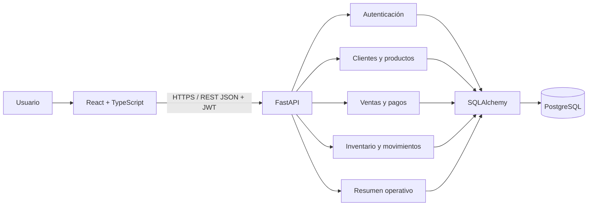

# Fase 02 — Arquitectura técnica

## Decisiones

- **Frontend:** React 18, TypeScript, Vite y React Router; interfaz por módulos de dominio.
- **Backend:** Python 3.11+, FastAPI, Pydantic y SQLAlchemy 2.
- **Persistencia:** PostgreSQL 16, SQL relacional y migraciones versionadas con Alembic.
- **Contrato:** REST/JSON bajo `/api/v1`; OpenAPI/Swagger generado por FastAPI.
- **Autenticación:** JWT Bearer; contraseñas derivadas con Argon2 mediante `pwdlib`.
- **Entorno local:** Docker Compose coordina base de datos, API y Vite.

## Arquitectura lógica



## Límites de módulos

- `auth`: inicio de sesión, emisión de token y perfil.
- `catalog`: clientes, categorías, productos y movimientos de inventario.
- `sales`: validación del carrito y operación transaccional.
- `dashboard`: agregaciones operativas para el panel.
- `services`: reglas de cálculo separadas de la capa HTTP.
- `models` / `schemas`: persistencia y DTO de entrada/salida independientes.

## Estructura fuente

```text
backend/app/       API, configuración, modelos, esquemas, servicios y rutas
backend/migrations/ Migraciones Alembic
backend/tests/     Pruebas unitarias
frontend/src/      Shell, componentes reutilizables y páginas React
 database/         Recursos de base de datos/semillas (extensión planificada)
docs/              Entregables académicos por fase
```

Las rutas reales están separadas en `backend/app/routers/` y `frontend/src/pages/`; la estructura completa puede inspeccionarse en el explorador del repositorio.

## Manejo de errores y configuración

- La API responde con los códigos HTTP estándar y un campo `detail` legible.
- El cliente Axios convierte errores HTTP en mensajes mostrables en la UI.
- Conexión, secreto, CORS, empresa y tasa tributaria se configuran por variables de entorno; no deben almacenarse secretos en Git.
- Los endpoints comerciales consultan siempre dentro del `company_id` del usuario.

## Decisión pendiente para despliegue

Definir proveedor, TLS, copias de seguridad, almacenamiento de secretos, límites de sesión, registro de auditoría, pool de conexiones y política de retención. Estos son entregables de fases 13 y 15; el Compose actual es solo local.
