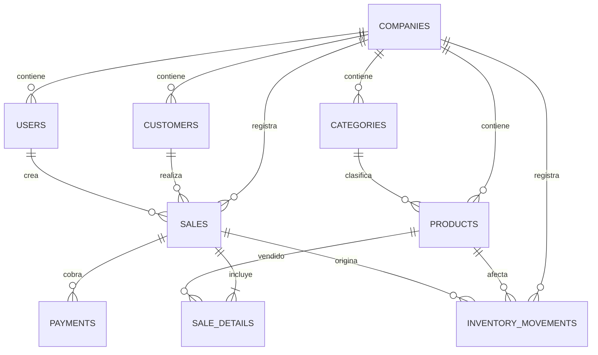

# Fase 04 — Modelo de datos PostgreSQL

## Modelo entidad-relación implementado

## Entidades operativas

| Tabla | Uso | Claves y controles principales |
|---|---|---|
| `companies` | Organización propietaria de los datos | PK `id` |
| `users` | Cuenta y autenticación | DNI único nullable; contraseña Argon2 nullable (nunca se devuelve); correo opcional único; subject Supabase opcional; FK empresa; rol y estado |
| `customers` | Contactos comerciales | FK empresa; búsqueda por nombre/correo/teléfono |
| `categories` | Agrupación de catálogo | FK empresa |
| `products` | Catálogo y existencia actual | FK empresa/categoría; precio positivo; stock y mínimo |
| `employees` | Personal comercial | FK empresa |
| `sales` | Cabecera, totales y estado | FK empresa/cliente/usuario; número de venta único |
| `sale_details` | Artículos y precio congelado al vender | FK venta/producto; cantidad, precio unitario e importe |
| `payments` | Cobro relacionado a la venta | FK venta; importe, método y estado |
| `inventory_movements` | Libro de cambios de stock | FK empresa/producto/venta; variación, saldo, motivo y fecha |

## Integridad y rendimiento

SQLAlchemy genera claves foráneas e índices para búsquedas habituales por empresa, DNI, correo, SKU, nombre, venta, producto y fecha. DNI conserva ocho dígitos como texto. La contraseña se valida con Argon2; borrar contraseña la deja nula y desactiva la cuenta. Dinero usa `NUMERIC(12,2)`. Cantidades usan enteros. Las ventas consultan y validan el stock bloqueando filas en motores que soportan `SELECT FOR UPDATE`.

## Migraciones y datos iniciales

`backend/migrations/versions/20261003_0001_initial.py` es la migración inicial Alembic; `20261003_0002_supabase_identity.py` agrega el subject opcional de Supabase; `20261003_0003_dni_credentials.py` agrega DNI único y permite credenciales/correo opcionales. `backend/app/seed.py` mantiene al usuario demo con DNI `00000001`, categorías, productos y clientes de ejemplo sin duplicarlos al reiniciar.

El modelo de datasets, variables estadísticas, observaciones, resultados, análisis Bayes, insights y reportes se añadirá cuando se implemente la fase 9; no se crean tablas sin casos de uso aún construidos.
